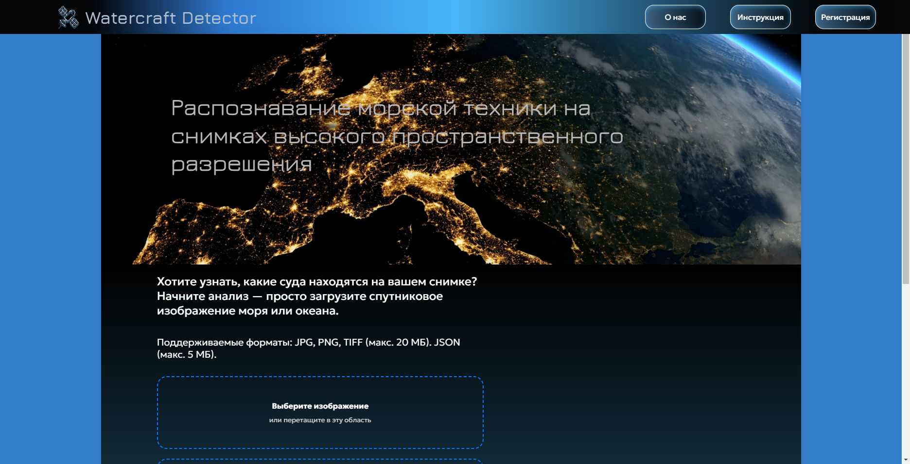
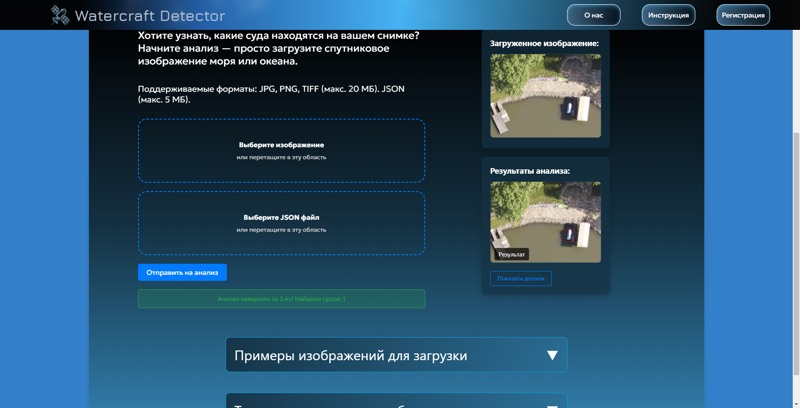
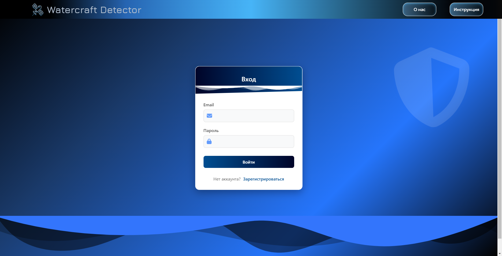
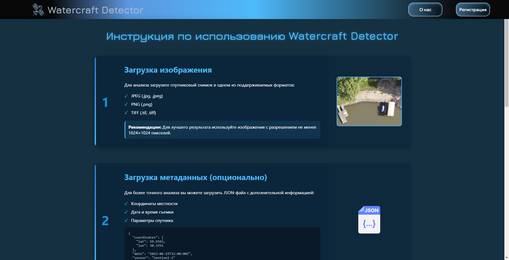

# Watercraft Detector

**Сервис распознавания морской техники на спутниковых снимках**



## 📌 Возможности

- Загрузка спутниковых изображений (JPG, PNG, TIFF)
- Автоматическое обнаружение судов
- Примеры результатов анализа
- Адаптивный интерфейс для всех устройств

## 🛠 Технологии

- **Frontend**: 
  
  
  
  

## 📂 Структура проекта

```
WatercraftDetector/
├── src/
│   ├── assets/       # Векторный логотип
│   ├── components/   # React-компоненты
│   ├── context/      # контекст аутентификации
│   ├── pages/        # Страницы приложения
│   ├── services      # Сервис для работы с api
│   ├── styles/       # Глобальные стили
│   └── App.js        # Корневой компонент
├── public/           # Статические файлы
└── package.json      # Зависимости
```
# Watercraft Detector 

WatercraftDetector — веб-приложение для обнаружения водного транспорта на спутниковых снимках с использованием React.

---

## 🚀 Быстрый старт

1. Скачайте node.js с официального сайта, если у вас еще не установлен:
  
  - https://nodejs.org/

2. Установка зависимостей:

```
npm install
npm start
```

##  🌐 Страницы

1. Главная (MainPage.jsx)


  
- Загрузка изображений через FileUpload.
- Примеры работ в компоненте Accordion.

  Компоненты:

- Hero — баннер с заголовком.
- Accordion — раскрывающиеся блоки.


2. Авторизация (AuthPage.jsx)



- Переключение между входом и регистрацией.
- Валидация пароля.

3. О проекте (AboutPage.jsx)

- Интерактивная временная шкала (анимация через Intersection Observer).
- Карточки команды.
- Форма обратной связи.

4. Инструкция (UserGuidePage.jsx)



- Пошаговая инструкция по использованию веб-приложения
- часто задаваемые вопросы

5. Личный кабинет 


## 📦 Зависимости
Список ключевых зависимостей (package.json):

```json
   {
  "@testing-library/dom": "^10.4.0",
  "@testing-library/jest-dom": "^6.6.3",
  "@testing-library/react": "^16.2.0",
  "@testing-library/user-event": "^13.5.0",
  "axios": "^1.9.0",
  "react": "^19.0.0",
  "react-dom": "^19.0.0",
  "react-router-dom": "^7.4.0",
  "react-scripts": "5.0.1",
  "web-vitals": "^2.1.4"
}
```

## 🎨 Стили
- Глобальные стили: 

src/styles/global.css.

- Модульные стили для каждой компоненты и страницы сайта(например, AboutPage.module.css).

## 📌 Возможности по улучшению

1. Добавление интерактивной карты для отображения местоположения обнаруженных судов

2. Реализация системы истории запросов

3. Добавиление возможность выбора фотографии для анализа в определенном местоположения

4. Добавление Redux для управления состоянием.
